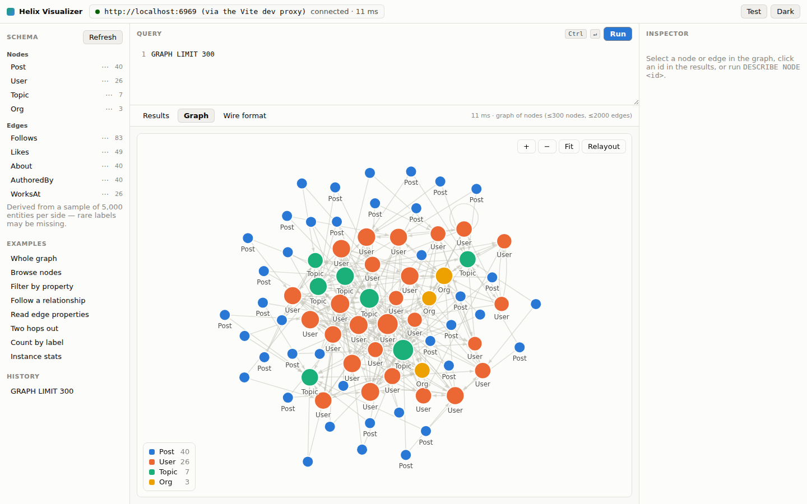

# Helix Visualizer

A Tauri desktop app for exploring a [HelixDB](https://github.com/HelixDB/helix-db)
instance: type SQL-like queries to pull back nodes, edges and their
relationships, and draw the graph structure as a whole.

See [PORTING_GUIDE.md](PORTING_GUIDE.md) for the complete Explorer-style UI,
connection, `/v1/query`, and automatic graph-loading change log.



## What it does

- **Welcome splash** — an Explorer-style startup animation previews a valid,
  read-only HelixSQL graph query before entering the workspace.
- **HelixSQL** — a small, read-only SQL dialect (`SELECT … FROM NODES … WHERE …
  TRAVERSE OUT …`) that compiles to HelixDB's JSON traversal AST. Full grammar
  below.
- **Graph view** — connecting from the Graph workspace automatically loads a
  bounded snapshot; a manual `GRAPH` query can replace it. The force-directed
  canvas supports pan, zoom, drag, neighbourhood focus on hover, and per-label
  colouring.
- **Inspector** — click a node or edge to see its properties, its incident edges
  with direction, its neighbours and its degree.
- **Schema sidebar** — node and edge labels discovered from the instance, each
  one a click away from a query.
- **Wire format tab** — the exact Explorer-compatible JSON sent to
  `POST /v1/query`, so nothing about the translation is hidden.

Queries are read-only by construction: the compiler only ever emits a `read`
batch, and there is no syntax for writes. Use a HelixDB SDK for those.

## Requirements

- Node.js 20+
- Rust 1.77+
- A running HelixDB instance (`helix start dev` listens on `localhost:6969`),
  or the bundled mock server below.
- Linux only: the usual Tauri v2 system dependencies —
  `libwebkit2gtk-4.1-dev`, `libsoup-3.0-dev`, `libjavascriptcoregtk-4.1-dev`,
  `librsvg2-dev`, `build-essential`, `libssl-dev`, `pkg-config`.

## Running it

```bash
npm install
npm run app          # tauri dev — builds the Rust backend and opens the window
```

Set the instance from Connection in the top toolbar. It is saved to the app
config directory and prefilled on the next launch. For a Docker mapping such as
`6969:8080`, enter the host-side port `6969`.

To build a distributable:

```bash
npm run app:build
```

The repo ships PNG icons only. For `.ico`/`.icns` (Windows and macOS bundles),
run `npm run tauri icon src-tauri/icons/icon.png` once.

### Without a HelixDB instance

`tools/mock-helix-server.mjs` exercises the SDK traversal representation over a small in-memory
sample graph (users, posts, topics, orgs). It interprets the same traversal AST
HelixDB does, for the subset of steps this app emits — it is a development
stand-in, **not** a HelixDB implementation.

```bash
npm run mock                       # listens on :6969
npm run app                        # point the app at http://localhost:6969
```

### In a browser

The frontend also runs as an ordinary web page, which is handy for quick
iteration:

```bash
npm run mock
npm run dev                        # http://localhost:5173
```

In that mode there is no Rust backend, so queries go through Vite's `/helix`
proxy instead. Point it elsewhere with `HELIX_URL=http://host:6969 npm run dev`.

## HelixSQL

HelixDB has no SQL dialect of its own; queries are built as a JSON traversal
AST. HelixSQL is a thin front end over that AST. The official
[`@helix-db/helix-db`](https://www.npmjs.com/package/@helix-db/helix-db) SDK
representation supplies validation and result-shape metadata, while the live
transport emits the flat Explorer-compatible format accepted by the current
enterprise-dev `/v1/query` endpoint.

Keywords are case-insensitive; labels and property names are not.

### SELECT

```
SELECT [DISTINCT] ( * | COUNT(*) | <column> [, …] )
FROM ( NODES | EDGES ) [ :<Label> ]
[ WHERE <condition> ]
[ TRAVERSE <direction> [<EdgeLabel>] [WHERE <condition>] ]…
[ GROUP BY <column> ]
[ ORDER BY <column> [ASC|DESC] [, …] ]
[ SKIP <n> ] [ LIMIT <n> ]
```

Without a `LIMIT`, 500 rows are fetched.

```sql
SELECT * FROM NODES:User LIMIT 25
SELECT id, name, age FROM NODES:User WHERE age BETWEEN 25 AND 40 ORDER BY age DESC
SELECT COUNT(*) FROM NODES GROUP BY label
SELECT id, label, source, target FROM EDGES:Follows LIMIT 50
```

**Virtual columns.** `id` and `label` work on both nodes and edges; `source` and
`target` are an edge's endpoints. `score` and `distance` are available where
HelixDB populates them. A reserved field can also be written out in full
(`$id`, `$label`, `$from.$id`, `$to.$id`). To read a *property* actually named
`id`, quote it: `SELECT "id" FROM NODES`.

`WHERE label = 'User'` and `FROM NODES:User` compile to the same thing — a label
match on the source step, so HelixDB can use its label index.

**Conditions.** `= != <> > >= < <=`, `AND`, `OR`, `NOT`, parentheses, `IN (…)`,
`BETWEEN … AND …`, `IS [NOT] NULL`, `HAS(<property>)`, and `LIKE` with `%` at
either end (`'ali%'`, `'%son'`, `'%li%'`). `_` is not supported.

**Traversal directions.**

| Direction | Starts from | Lands on |
|---|---|---|
| `OUT` / `IN` / `BOTH` | node | neighbouring nodes |
| `OUT EDGES` / `IN EDGES` / `BOTH EDGES` | node | the edges themselves |
| `SOURCE` / `TARGET` / `OTHER` | edge | the edge's endpoints |

```sql
-- who does Alice follow, and who do they follow?
SELECT DISTINCT id, name
FROM NODES:User WHERE name = 'Alice'
TRAVERSE OUT Follows
TRAVERSE OUT Follows

-- read a property stored on the relationship itself
SELECT label, source, target, since
FROM NODES:User
TRAVERSE OUT EDGES Follows WHERE since > 2022
```

Using a hop from the wrong side (`FROM EDGES … TRAVERSE OUT`) is rejected before
anything is sent, with the offending clause pointed at.

### GRAPH

Returns nodes plus the edges among them, and draws them.

```
GRAPH [ [FROM] NODES[:<Label>] ]
[ WHERE <condition> ] [ TRAVERSE … ]…
[ VIA <EdgeLabel> ] [ WITH <property> [, …] ]
[ ORDER BY … ] [ SKIP <n> ] [ LIMIT <n> ] [ EDGE LIMIT <n> ]
```

`LIMIT` caps nodes (default 400), `EDGE LIMIT` caps edges (default 2000), `VIA`
restricts which edge label is drawn, and `WITH` fetches node properties so the
canvas can label nodes by name rather than by type.

Edges are always fetched by walking out from the nodes that were selected, so
they belong to the part of the graph on screen. On a graph larger than `LIMIT`
some of them will still lead to nodes that were not fetched; those cannot be
drawn, and the view reports how many rather than dropping them silently.

```sql
GRAPH LIMIT 300
GRAPH NODES:User VIA Follows WITH name LIMIT 150
GRAPH NODES WHERE id = 42 TRAVERSE BOTH LIMIT 200
```

Only edges whose *both* endpoints are in the fetched node set can be drawn. Any
that leave the selection are counted and reported under the canvas rather than
silently dropped.

### SHOW and DESCRIBE

```sql
SHOW LABELS [SAMPLE <n>]     -- also: SHOW NODE LABELS, SHOW EDGE LABELS
SHOW STATS                   -- node/edge totals plus label breakdowns
DESCRIBE NODE <id> [LIMIT <n>]
DESCRIBE EDGE <id>
```

HelixDB has no catalog to query, so labels are derived by counting `$label` over
a bounded sample (5000 entities by default). Rare labels can be missed; the
sample size is stated wherever labels are shown.

### Keyboard and mouse

| | |
|---|---|
| `Ctrl`/`Cmd` + `Enter` | run the query |
| double-click a node | load its neighbourhood into the editor |
| drag a node | pin it while dragging |
| scroll | zoom about the cursor |

## How it fits together

```
src/hql/          lexer → parser → AST → compiler (emits the HelixDB query AST)
src/results.ts    decodes a response into the view models the UI renders
src/graph/        force layout (Barnes–Hut) + canvas renderer + colour assignment
src/ui/           editor, results table, inspector, sidebar, connection bar
src-tauri/        Rust backend: connection settings + an HTTP proxy to Helix
tools/            mock HelixDB server, icon generator
```

The webview never talks to HelixDB directly. It hands the serialized query to
the Rust command `run_query`, which posts it to `{url}/v1/query`. That keeps the
app clear of webview CORS rules, lets an `https`-origin webview reach a
plain-HTTP local instance, and keeps the API key in the backend's config file
rather than in webview storage. That file is written to the platform config
directory as `connection.json`, narrowed to `0600` on Unix; the key is stored in
plain text, so it is protected by file permissions rather than by a keychain.

Entity ids are `i64`, which JavaScript cannot hold exactly in a `number`. The
Rust side returns the response as text and the frontend parses it with the SDK's
`parseJson`, so ids above 2^53 survive as `bigint` end to end.

## Tests

```bash
npm test                    # parser, compiler, and end-to-end against the mock
npm run typecheck
cargo test --manifest-path src-tauri/Cargo.toml
```

The end-to-end tests boot the mock server and drive the SDK-representation path
from HelixSQL text through HTTP and decoded results. Separate legacy compiler
tests cover the Explorer-compatible production wire format. They verify this
app's pipelines; they are not a conformance test against every HelixDB version.

## Known limits

- Read-only. There is no `INSERT`/`UPDATE`/`DELETE` syntax.
- `VIA` takes a single edge label, not a list.
- `LIKE` supports `%` only at the start and/or end of the pattern.
- `SELECT *` runs the selection twice inside one batch — once for the stored
  properties and once for `$id`/`$label`, since a traversal has only one
  terminal — and merges the two positionally. If they ever come back with
  different lengths the properties are shown without ids rather than
  mislabelled. Name the columns explicitly to avoid the second pass.
- Sorting a results table sorts the rows already fetched; `ORDER BY` in the query
  is what sorts the whole result set.
- The graph view colours up to 8 labels; beyond that the rarest fold into a
  neutral "Other" bucket rather than reusing a hue.
